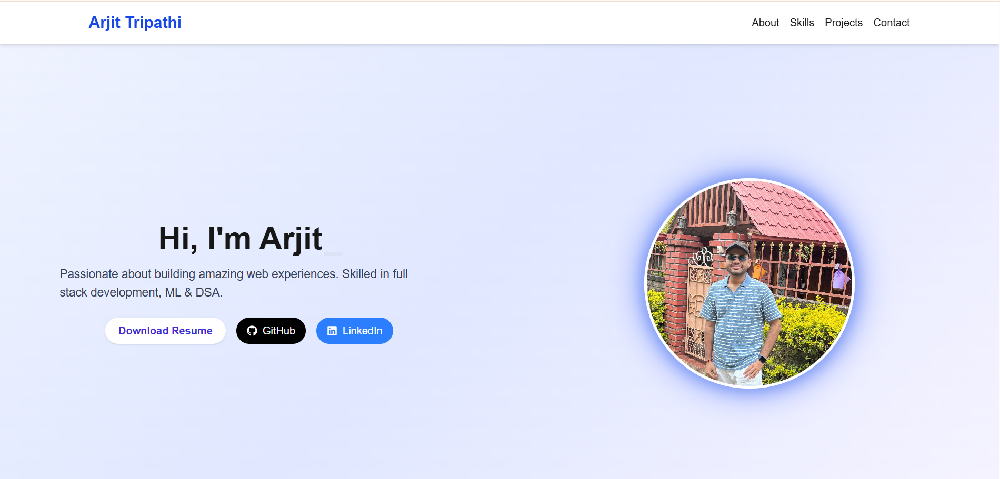

# 🚀 Arjit Tripathi — Personal Portfolio

Welcome to my personal portfolio website, built using **Next.js 15**, **Tailwind CSS**, and **Framer Motion**.  
It showcases my projects, skills, experience in **Full Stack Web Development**, **DSA**, and **Competitive Programming**.

Live Demo 👉 [portfolio](https://portfolio-sage-two-16.vercel.app/)

---

## 📸 Preview



---

## 🛠️ Tech Stack

- ⚛️ [Next.js 15 (App Router)](https://nextjs.org/)
- 💨 [Tailwind CSS](https://tailwindcss.com/)
- 🎞️ [Framer Motion](https://www.framer.com/motion/)
- 🌐 [Vercel Hosting](https://vercel.com/)
- 🧩 [Lucide Icons](https://lucide.dev/)

---

## 🧩 Features

- ✨ Beautiful Hero section with Typewriter effect
- 📖 About Me section
- 💼 Skills with animated icons and hover effects
- 🧠 Projects in animated timeline layout with GitHub + Live Demo buttons
- 🧠 DSA & CP section highlighting strengths and profile links
- 📞 Contact form with details + dummy submission
- 👣 Footer with resume download, GitHub, LinkedIn, and animated buttons
- 🌙 Dark mode-ready design (optional)

---

## 🧪 How to Run Locally

```bash
# Clone the repository
git clone https://github.com/omni-ar/portfolio.git
cd portfolio

# Install dependencies
npm install

# Run the dev server
npm run dev

# Visit in browser
http://localhost:3000
```

## 📃 License

This project is open-source and free to use under the MIT License.

Built with ☕ by Arjit Tripathi